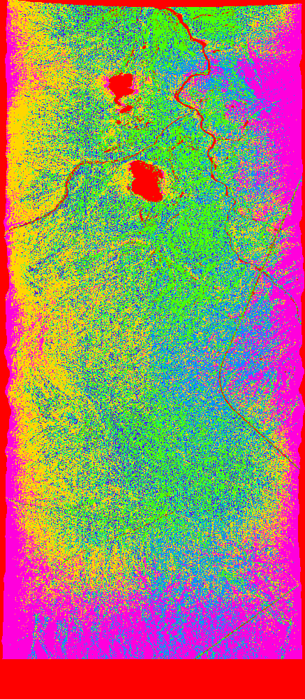

# Parallel-KMeans
KMeans implementation with OpenMP in C++

The programm allows to performs clustering for the specified image file.

[Documentation with approach explained](Project_report.pdf)

Example of rendered result (GIF):




## Usage:
```
ParallelK.exe [-k numClusters] [-ksearch searchThreads kmeansThreads] [-i maxIterations] [-d dataUsage] [-s] [-o] [-v] [-t]

ARGUMENTS:
-k          Number of clusters to compute (default=10).
-ksearch    Execute the algorithm over the number of clusters in range [2, k]. Specify the numbers of threads for search and KMeans computation.
-i          Max number of iterations to perform (default=10).
-d          Data usage fraction 0=min, 4=max (default=1).
-s          Visualize the results of algorithm execution.
-o          Write resulting clusters to log file.
-t          Write execution time to log file.
```


